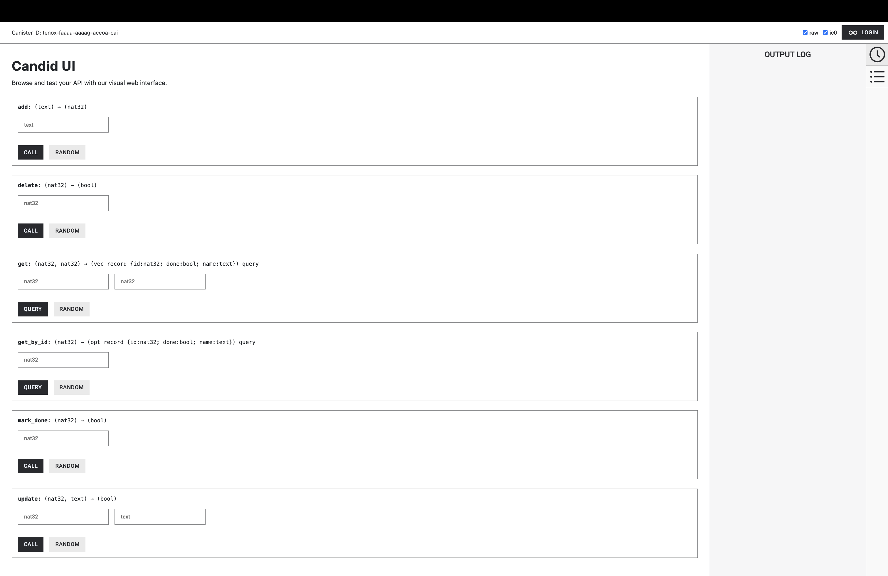
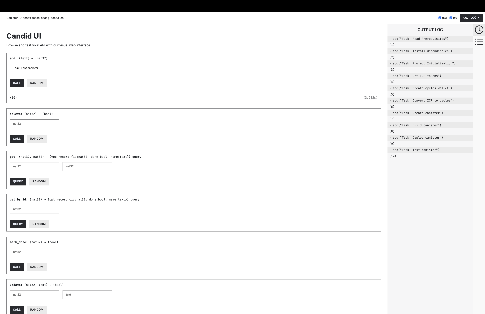
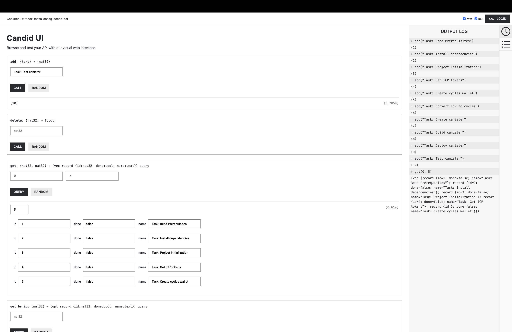
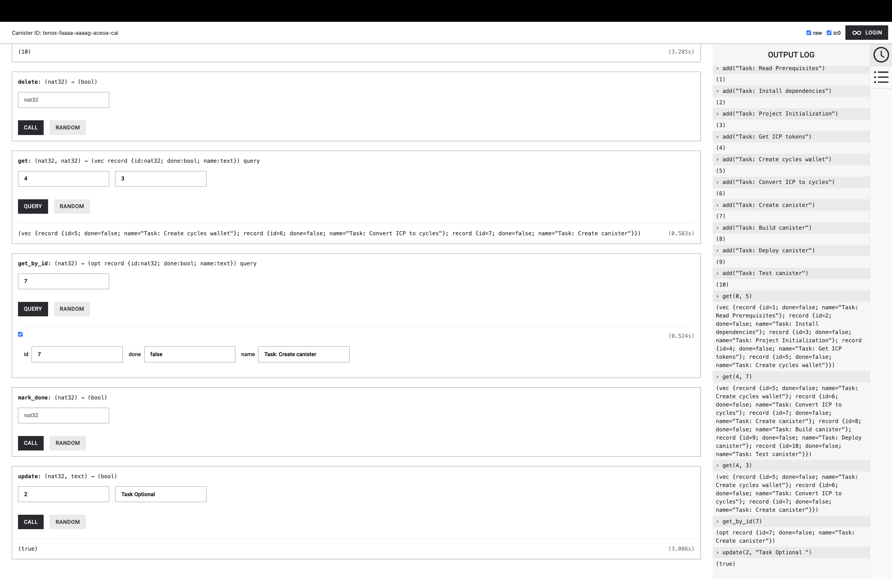
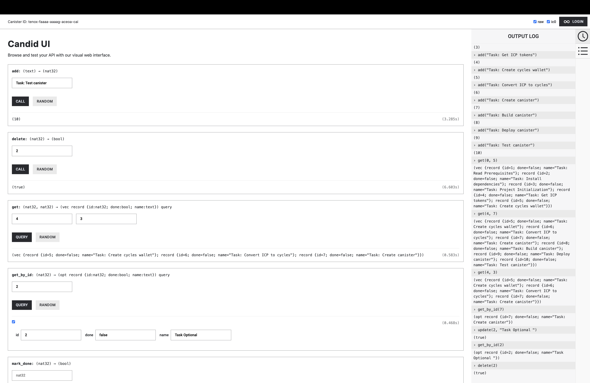
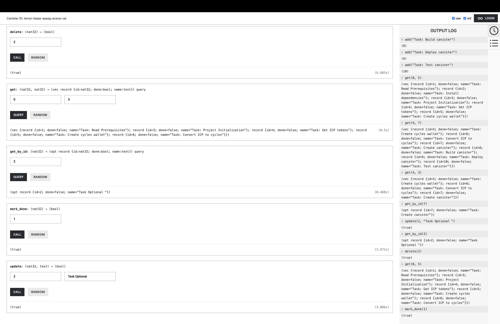
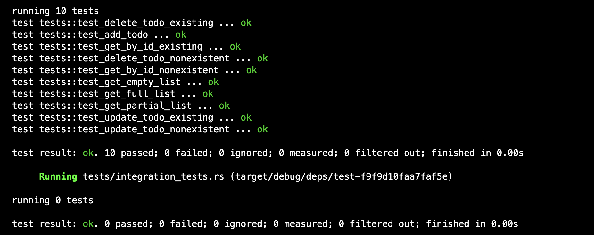

# Hot or Not Assignment 
Step-by-step instructions and commands used in setting up and deploying the "Hot or Not Assignment for CRUD operations of a TODO list" project using the Internet Computer (IC) platform.

## Prerequisite installations
Before starting, ensure that you have the DFINITY Canister SDK and the Internet Computer utility (dfx) installed.

## Project Initialization
Rust project for the Hot or Not Todo list crud operations assignment:

## Build and deployment commands
- Update dependencies: 
```
cargo update
```
- Build: 
```
dfx build --network ic hot_or_not_assignment_backend
```
- Install canisters: 
```
dfx canister --network ic install hot_or_not_assignment_backend
```
- Deploy a canister to IC network: 
```
dfx deploy --network ic hot_or_not_assignment_backend
```

## Testing commands
- Unit test: 
```
cargo test
```

## Links to deployment
- Canister link: [https://a4gq6-oaaaa-aaaab-qaa4q-cai.raw.icp0.io/?id=tenox-faaaa-aaaag-aceoa-cai](https://a4gq6-oaaaa-aaaab-qaa4q-cai.raw.icp0.io/?id=tenox-faaaa-aaaag-aceoa-cai)

## UI Results
1. UI Result 
2. Add Task 
3. Get Tasks Using Pagination 
4. Update By Id 
5. Delete By Id 
6. Get By Id 


# Test cases Results
Test cases results 